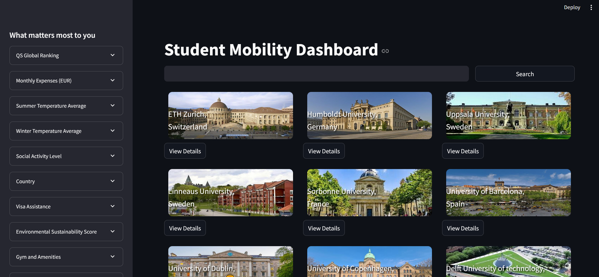

# Student Mobility Dashboard

This dashboard is a prototype created for the Baltic Hackathon 2024 Base Camp. The task was to create a student mobility dashboard for the Baltic Sea Region: Enhancing the academic experience through accessible data.

## Overview

The prototype will allow students who want to study in universities in the Baltic Sea Region to find the right institution for them. On the dashboard the user can filter for the qualities that are most important for them from how cold the winters to the average cost of living of the area to the institution's global education quality rating.

## Set up an execution
1. Install the streamlit with :
    pip install streamlit
2. Navigate to the app directory and run:
    streamlit run app.py
    A browser window will open with the dashboard. 

[Watch the video](app/media/dashboard_in_action.mp4)

### Limited Functionality and Future Feature Implementation
At this moment the protype i